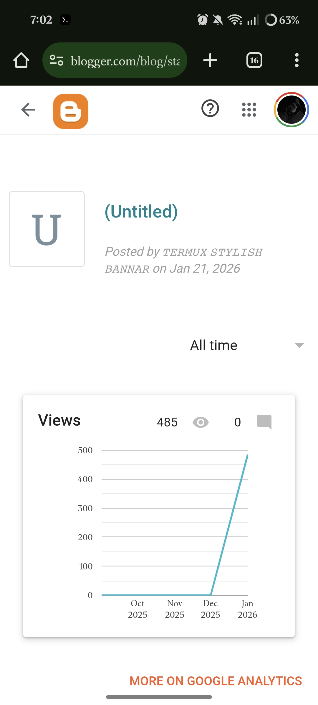
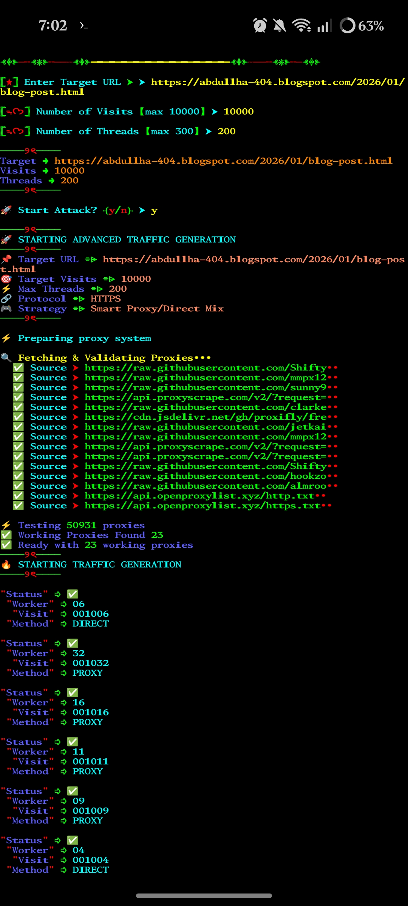
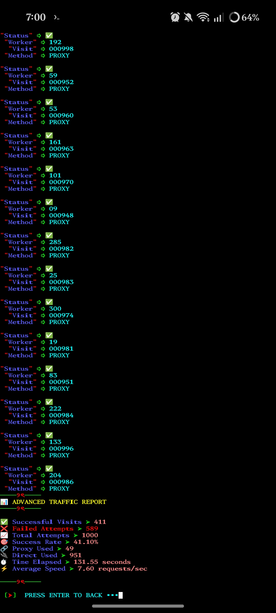

# 🚦 Blogger Website Traffic Simulator  
### 🔥 Fix Error 503 • Boost Testing Traffic • Educational Tool


---

## 📌 About This Project

**WEB_TRAFFIC** একটি Python-based educational tool যা  
👉 Website traffic behavior  
👉 Server load testing  
👉 Blogger / Website Error 503 (Service Unavailable) analysis  

এই বিষয়গুলো শেখার জন্য তৈরি করা হয়েছে।

⚠️ **এটি শুধুমাত্র Educational & Testing Purpose এর জন্য।**

---

## ❓ Why Error 503 Happens?

🔴 Server overload  
🔴 Too many requests  
🔴 Hosting limitation  
🔴 Misconfigured traffic handling  

এই tool ব্যবহার করে আপনি বুঝতে পারবেন:
- Traffic কিভাবে server-এ impact ফেলে
- কেন Blogger বা Website হঠাৎ unavailable হয়

---

## 🚀 Features

✅ Simple & lightweight  
✅ Python based  
✅ Easy to use  
✅ Beginner friendly  
✅ Educational traffic simulation  

---

## 🛠 Installation

```bash
git clone https://github.com/Xylon-404/WEB_TRAFFIC.git
cd WEB_TRAFFIC
python traffic.py
```

📷 Demo
```
[+] Sending traffic request...
[+] Target responding...
[!] Server overloaded (503 detected)
```

##⚠️ Disclaimer
❗ এই tool কখনোই:
Iilegal traffic
DDoS attack
Website harm করার জন্য নয়


##👉 Only for learning, testing & research purpose
কোনো website-এ misuse করলে author 
দায়ী থাকবে না।


## 📸 Gallery






## 📸 Gallery

<p align="center">
  
</p>

<p align="center">
  
</p>

<p align="center">
  
</p>

<p align="center">
  
</p>


##💡 Who Can Use?
👨‍💻 Beginner Python learners
👨‍💻 Cyber Security students
👨‍💻 Web developers
👨‍💻 Blogger troubleshooting learners
🌟 Support & Share
যদি project-টা ভালো লাগে:
⭐ Repo-তে Star দাও
🍴 Fork করো


##📢 Share করো বন্ধুদের সাথে
Knowledge should be free!


##👤 Author
Xylon-404
🔗 GitHub: https://github.com/Xylon-404


##🖤 Final Note
“Learn responsibly. Code ethically.”
Happy Coding 🚀

---

চাও তো আমি  
✅ আরও **viral tagline**  
✅ **SEO friendly keywords**  
✅ GitHub **preview image/banner text**  
এগুলোও বানিয়ে দিতে পারি 🔥
